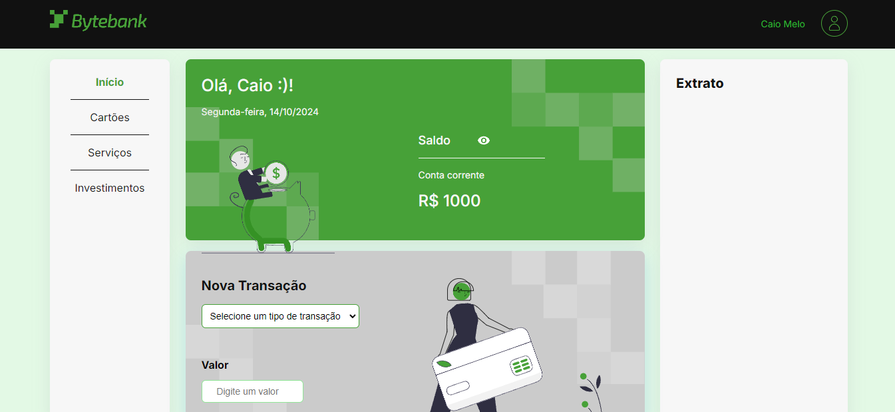
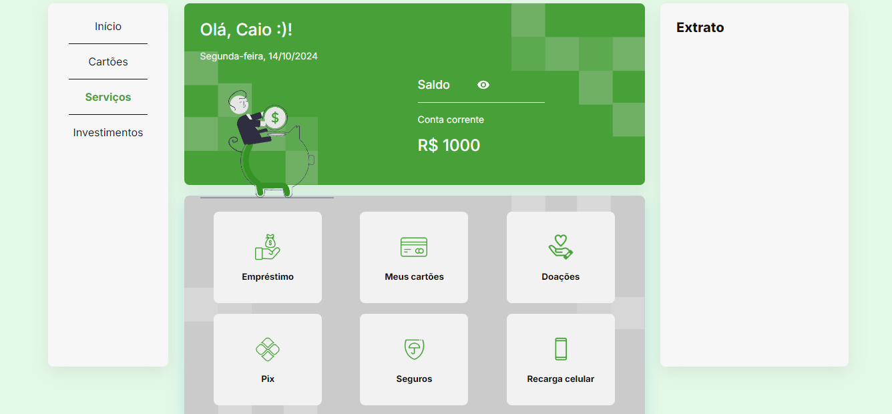

# 🏦 ByteBank - Testes com Jest e ReactJS

Este repositório contém o projeto Bytebank, desenvolvido com fins educacionais. Seu objetivo é fornecer um exemplo prático de como implementar testes automatizados em uma aplicação ReactJS utilizando o Jest.

## 🚀 Instalação

Após clonar o projeto, acesse o diretório e digite o comando abaixo para instalar as dependências necessárias:

npm install

## Executando os testes

Este projeto usa o Jest como ferramenta para escrever e executar testes automatizados. Para executar os testes, basta rodar o comando abaixo:

```bash
npm run test
```

Isso irá iniciar o Jest em modo de observação, que irá ficar monitorando as mudanças nos arquivos do projeto e executando os testes sempre que houver alguma mudança.

## 💻 Tecnologias utilizadas

Para construção desse projeto foram utilizados:

- HTML
- CSS
- JavaScript
- TypeScript
- JEST 

## Resultado :




## Confira: 

https://bytebank-dev.netlify.app/
